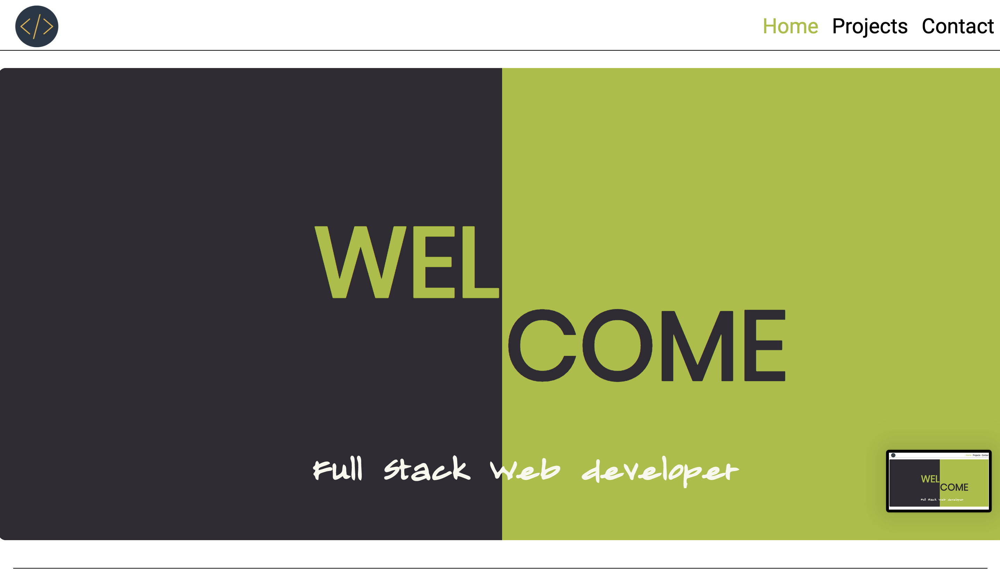
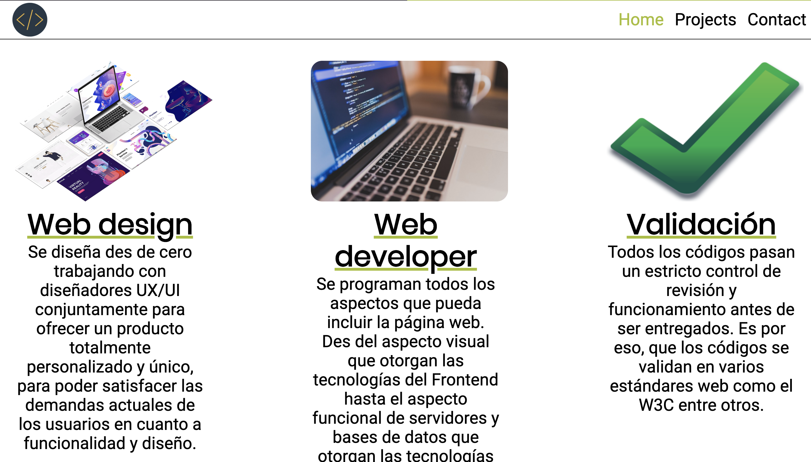
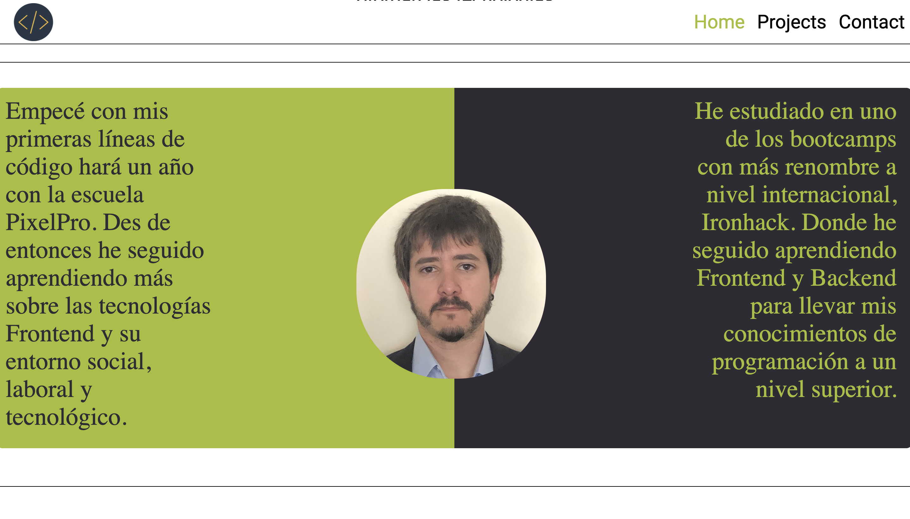
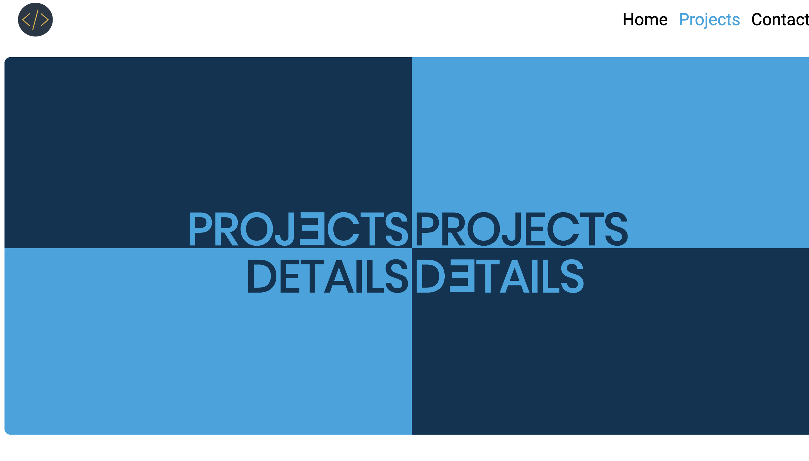
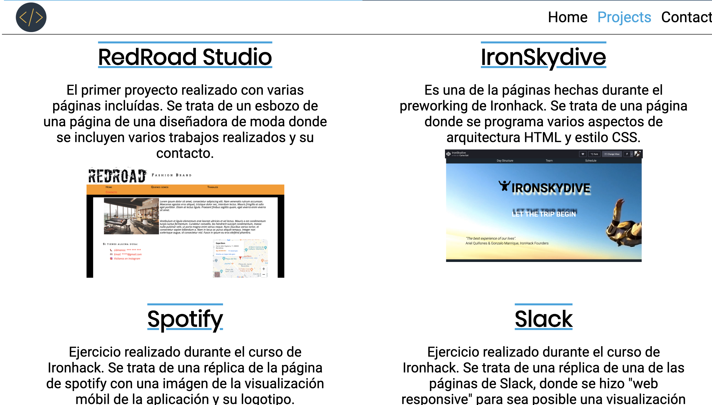
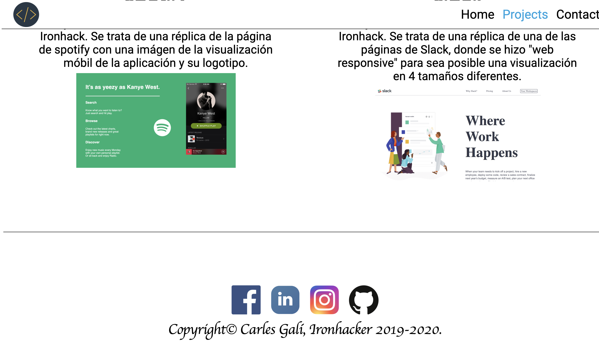
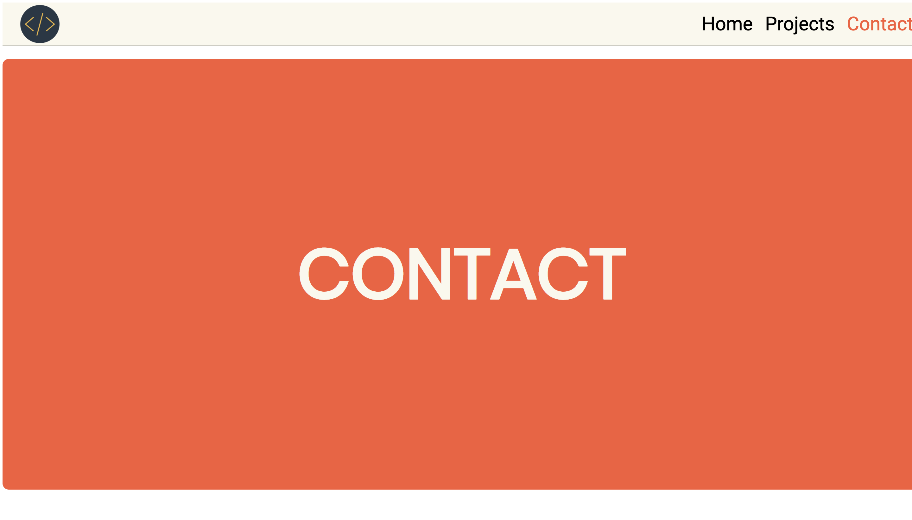
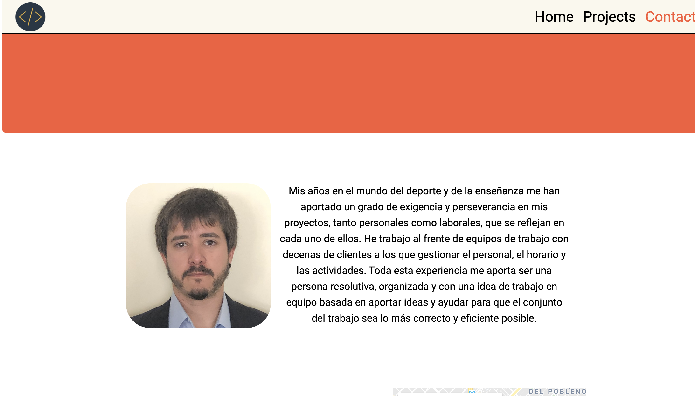

                PORFOLIO | CARLES GALÍ

Proyecto basado en mi experiencia como desarrollador Front end. En él podréis encontrar una explicación de mis conocimientos y mis estudios.

Aparte, encontraréis poryectos de varios tipos realizados durantes mis estudios en Ironhack BCN y mi contacto con varios enlaces a mis perfiles sociales más comunes

La página consta de 3 partes:

 - Welcome page: en ella se encuentra los 3 puntos que de los que constan mis proyectos en general y una breve explicación de mis conocimientos y estudios como desenvolupador.  

   
  
 - Projects details: en esta página encontraréis una selección de mis proyectos como desarrollador web. Podréis acceder a ellos a través del título hasta donde estan almacenados.  

   
  
 - Contact: aquí econtraréis una breve introducción de mis aptitudes como trabajador en un ámbito general. Aparte, encontraréis varios enlaces de mis datos de contacto y mis perfiles profesionales.  

 
 
 
 
 
Para finalizar quisiera decir agradecer a mis profesores, que de manera directa e indirecta me han ayudado a realizar este portfolio dándome recursos e ideas para diseñar y desenvolupar este proyecto.
 
 
 
 
 
Como dicen en mi escuela, Keep coding ❤️
